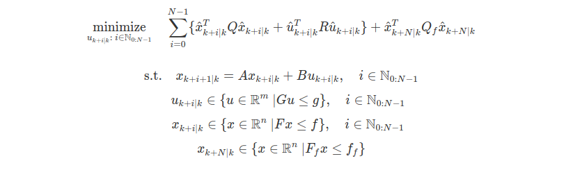
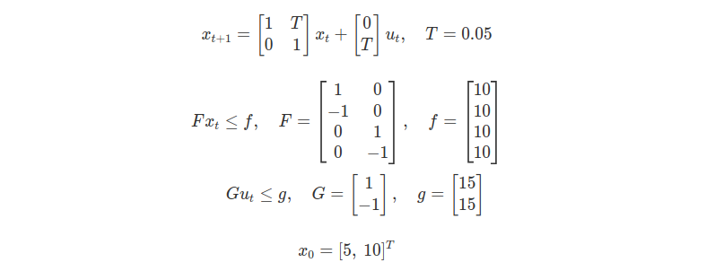
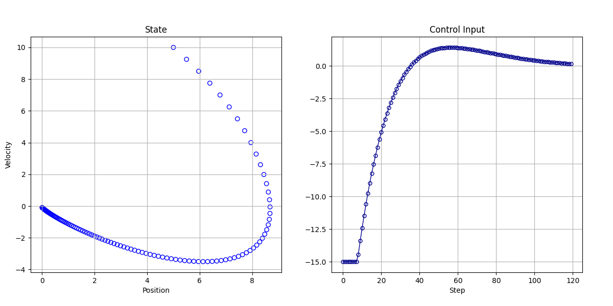

# LTI-MPC
An implementation of the model predictive controller for linear time invariant systems in Python3.
I mainly refferd the paper "[Implementation of Linear Model Predictive Control - Tutorial](https://arxiv.org/abs/2109.11986v1)".

<br>

## Problem Definition
The optimization problem in the MPC of this repo is as follows.
### Regulation



## Installaion
```sh
pip3 install numpy scipy matplotlib cvxopt pyyaml
```

## Usage
### Example


```sh
python3 main.py --steps 120 --cfg cfg/cfg.yaml --output result
```


<br>

## References
1. [Michael Fink. Implementation of Linear Model Predictive Control - Tutorial.](https://arxiv.org/abs/2109.11986v1)

2. Francesco Borrelli, Alberto Bemporad, and Manfred Morari. Predictive Control for Linear and Hybrid Systems, Cambridge University Press, 2017.
 